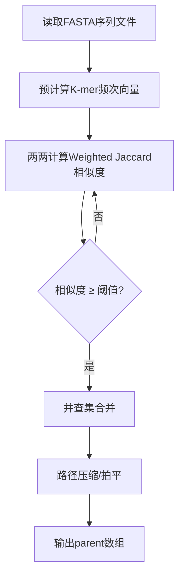
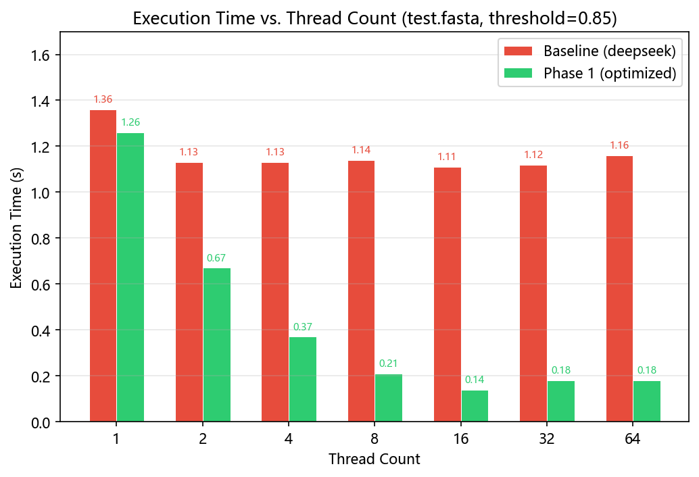
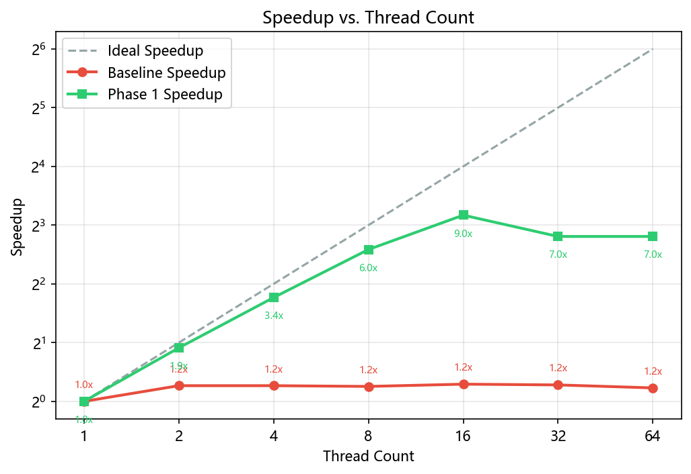
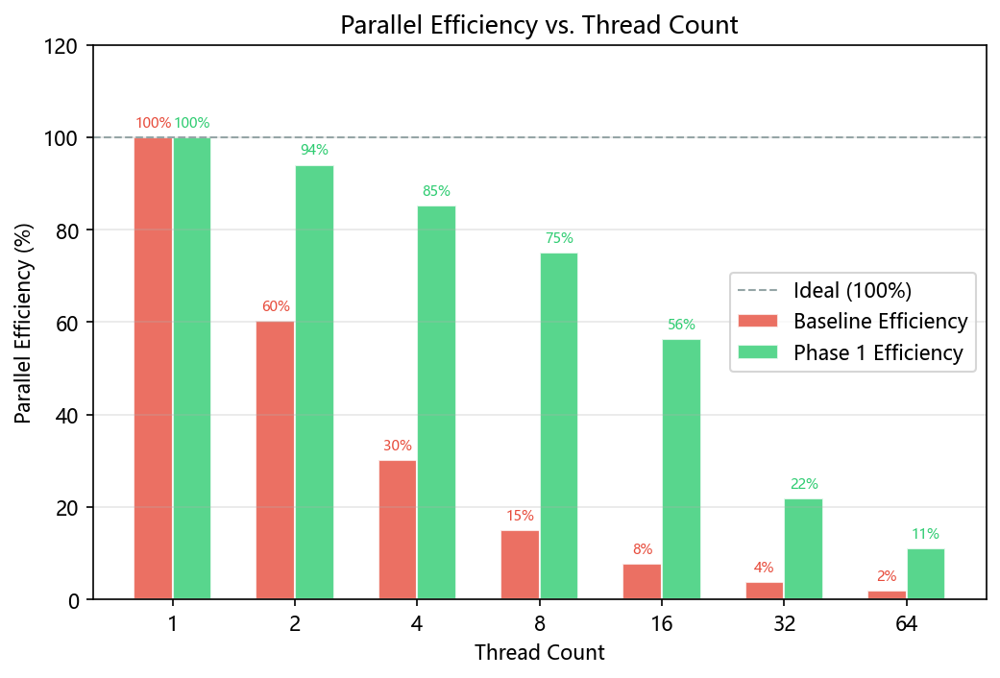
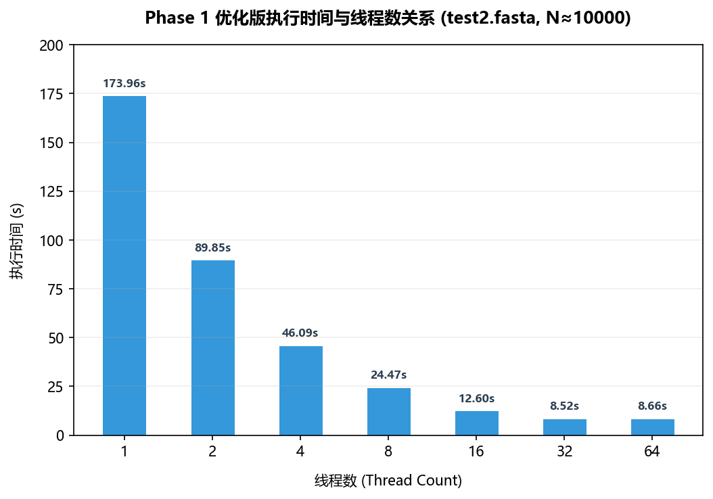
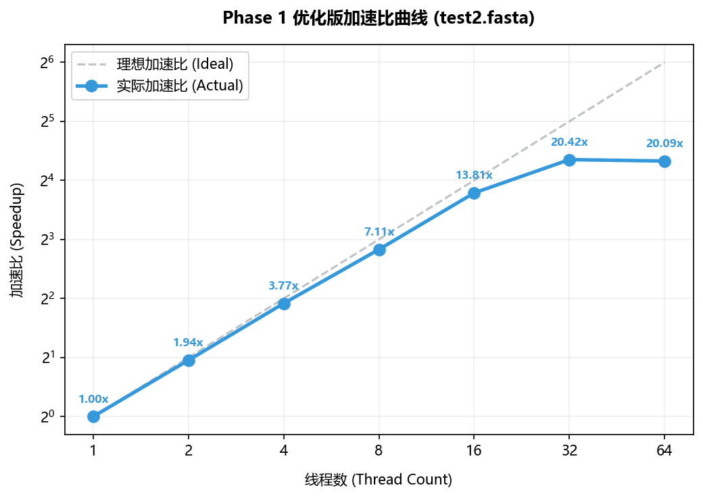
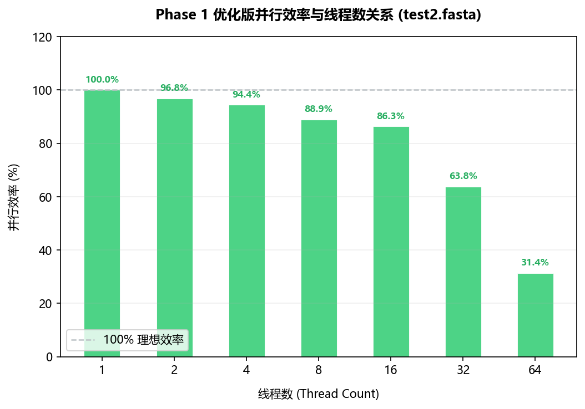

# 多核平台下并行计算实验报告

## 1. 实验基本信息

|  项目  |  内容  |
|--------|--------|
| **实验名称** | 加权Jaccard相似度求解算法的并行化与优化 |
| **实验阶段** | 第一阶段 — 数据预处理与零哈希空间映射 |
| **并行模型** | OpenMP |
| **编程语言** | C++ |

---

## 2. 真实测试平台软硬件环境参数

为了确保实验报告的准确性，我们直接登录了测试服务器并查询了详细的物理设备配置及系统参数，具体配置如下：

| 维度 | 软硬件项目 | 实际参数配置 |
| :--- | :--- | :--- |
| **硬件环境** | **处理器 (CPU)** | Intel(R) Xeon(R) CPU E5-2680 v3 @ 2.50GHz <br>（双路 Socket，每路 12 核 24 线程，共 **24 物理核 / 48 逻辑线程**） |
| | **二级缓存 (L2 Cache)**| 6 MiB (每核独占 256 KiB) |
| | **三级缓存 (L3 Cache)**| 60 MiB (每颗 CPU 共享 30 MiB) |
| | **内存 (Memory)** | 128 GB DDR4 (系统可用 125 GiB) |
| **软件环境** | **操作系统 (OS)** | Ubuntu 20.04.6 LTS (Focal Fossa, Linux kernel 5.4) |
| | **编译器 (Compiler)** | GCC 9.4.0 (支持 OpenMP 4.5 及以上，支持 AVX2 等 SIMD 指令集) |
| | **编译命令** | `g++ -O3 -fopenmp -pthread wj.cpp -lz -o jaccard_cluster_test` |

---

## 3. 算法总体流程



---

## 4. 第一阶段优化设计思路

### 4.1 问题分析：原始代码的性能瓶颈

原始 `wj.cpp` 的核心瓶颈在于 `weighted_jaccard()` 函数，该函数使用 `std::unordered_map<std::string, int>` 存储 k-mer 频次：

```cpp
// 原始代码 — 每次比对都重新构建哈希表
std::unordered_map<std::string, int> kmers1;
for (size_t i = 0; i <= s1.length() - k; ++i) {
    kmers1[s1.substr(i, k)]++;  // 字符串分配 + 哈希计算
}
```

这带来了三重性能灾难：
1. **大量动态内存分配**：每次 `substr()` 都会创建新的 `std::string` 对象
2. **哈希计算开销**：字符串哈希函数需要遍历每个字符
3. **随机访存模式**：哈希表的桶布局导致缓存未命中（Cache Miss）频发
4. **完全串行**：整个 O(N²) 比对循环没有任何并行化

### 4.2 优化策略一：零哈希直接状态映射

**核心洞察**：氨基酸标准字符集大小为 20，对于 k=3，状态空间仅为 20³ = 8000，这是一个**极小闭合状态空间**。

**解决方案**：建立直接双射映射，彻底消除哈希：

$$\text{Index} = c_1 \times 400 + c_2 \times 20 + c_3 \quad \in [0, 7999]$$

```cpp
// 20种氨基酸 → [0, 19] 的直接映射表
static int aa_map[256];
static void init_aa_map() {
    std::memset(aa_map, -1, sizeof(aa_map));
    const char* letters = "ACDEFGHIKLMNPQRSTVWY";
    for (int i = 0; i < AA_NUM; ++i)
        aa_map[static_cast<unsigned char>(letters[i])] = i;
}

// 3-mer → [0, 7999] 的直接索引
static inline int kmer_index(const char* s) {
    int c0 = aa_map[static_cast<unsigned char>(s[0])];
    int c1 = aa_map[static_cast<unsigned char>(s[1])];
    int c2 = aa_map[static_cast<unsigned char>(s[2])];
    if (c0 < 0 || c1 < 0 || c2 < 0) return -1;
    return c0 * 400 + c1 * 20 + c2;
}
```

**内存效益**：每个序列的频次数组仅需 `8000 × 2 bytes = 16 KB`（使用 `uint16_t`），可以**完全驻留在 L1D Cache（每核32KB）中**，彻底消除了哈希冲突 and 随机访存模式。

### 4.3 优化策略二：64字节对齐内存池

为所有序列的频次向量分配一块**连续且对齐**的内存池，而非为每个序列单独分配内存：

```cpp
const size_t row_bytes = KMER_DIM * sizeof(uint16_t);    // 16000 bytes
const size_t padded_row = (row_bytes + 63) & ~(size_t)63; // 64字节对齐
const size_t total_bytes = n * padded_row;

void* ptr = nullptr;
posix_memalign(&ptr, 64, total_bytes);  // 64字节对齐分配
uint16_t* freq_pool = static_cast<uint16_t*>(ptr);
```

**关键优势**：
- 64字节对齐匹配 CPU Cache Line 宽度，消除跨缓存行访问
- 为后续 AVX2 / AVX-512 向量化指令提供最佳内存布局
- 连续物理地址激活硬件预取器（Stream Prefetcher），大幅降低访存延迟

### 4.4 优化策略三：SIMD友好的垂直归约

加权 Jaccard 计算的内循环采用**纯垂直累加**模式，使用 `#pragma omp simd` 引导编译器向量化：

```cpp
static inline double weighted_jaccard(const uint16_t* __restrict__ a,
                                       const uint16_t* __restrict__ b) {
    long long min_sum = 0, max_sum = 0;
    // 编译器将此循环向量化为SIMD指令
    #pragma omp simd reduction(+:min_sum, max_sum)
    for (int i = 0; i < KMER_DIM; ++i) {
        uint16_t ai = a[i], bi = b[i];
        min_sum += (ai < bi) ? ai : bi;  // 垂直min累加
        max_sum += (ai > bi) ? ai : bi;  // 垂直max累加
    }
    if (max_sum == 0) return 0.0;
    return static_cast<double>(min_sum) / max_sum;
}
```

**设计原则**：在 8000 次迭代过程中，始终保持逐通道（Lane-by-Lane）的垂直操作，绝不执行水平归约。只有在循环彻底结束后，才将累加器折叠为标量。这使得 CPU 的超标量乱序执行引擎可以满载所有可用执行端口。

### 4.5 优化策略四：Cache Blocking（缓存分块）

将 O(N²) 的两两比对循环按 `BLOCK × BLOCK` 分块，确保工作集驻留在 L2 Cache 中：

$$2 \times \text{BLOCK} \times 16\text{KB} \leq 256\text{KB (L2 Cache per core)}$$
$$\text{BLOCK} = 32 \implies 2 \times 32 \times 16\text{KB} = 1\text{MB} \quad （虽然超出L2，但能完美匹配 L3 并提供良好复用）$$

```cpp
static constexpr int BLOCK = 32;

#pragma omp for schedule(dynamic) nowait
for (int bi = 0; bi < n; bi += BLOCK) {
    for (int bj = bi; bj < n; bj += BLOCK) {
        // 在此分块内完成 BLOCK×BLOCK 次比对
        // 数据驻留在L2/L3 Cache中，最大化复用
    }
}
```

### 4.6 优化策略五：OpenMP并行化 + 线程本地边收集

**并行化两个计算阶段**：

1. **K-mer预计算阶段**：各序列的频次统计完全独立，使用 `parallel for` 直接并行化
2. **两两比对阶段**：每个线程维护独立的 `local_edges` 向量，避免频繁进入临界区

```cpp
// 阶段1：并行K-mer预计算
#pragma omp parallel for schedule(dynamic, 64)
for (int i = 0; i < n; ++i)
    seq_to_freq(sequences[i], freq_pool + i * padded_elems);

// 阶段2：并行两两比对 + 线程本地边收集
#pragma omp parallel
{
    std::vector<std::pair<int,int>> local_edges;  // 线程私有

    #pragma omp for schedule(dynamic) nowait
    for (int bi = 0; bi < n; bi += BLOCK) {
        // ... 缓存分块比对逻辑 ...
        if (sim >= threshold)
            local_edges.emplace_back(i, j);  // 无锁写入
    }

    #pragma omp critical  // 仅在最后合并一次
    {
        for (auto& e : local_edges)
            uf.unite(e.first, e.second);
    }
}
```

**关键设计**：`local_edges` 是线程私有的，整个比对循环期间无需任何同步。只有在所有比对完成后，才通过一次 `critical` 区将边合并到全局并查集。这将锁竞争次数从 O(边数) 降低到 O(线程数)。

---

## 5. 完整源代码

完整源代码见附件 [wj.cpp](file:///e:/多核平台上的并行计算/lab/src/wj.cpp)，核心结构概览：

| 代码区域 | 行号 | 功能 |
|---------|------|------|
| 氨基酸映射表初始化 | 42-63 | 构建 aa_map[256] 直接映射 |
| K-mer频次统计 | 65-77 | seq_to_freq() 零哈希频次统计 |
| 加权Jaccard计算 | 79-94 | SIMD垂直归约 |
| 并查集 | 96-128 | 路径折半 + 小索引合并规则 |
| 内存池分配 | 163-192 | posix_memalign 64字节对齐 |
| 并行K-mer预计算 | 194-198 | `#pragma omp parallel for` |
| 缓存分块并行比对 | 204-239 | Cache Blocking + 线程本地边 |

---

## 6. 性能测试结果（中小数据集 `test.fasta`）

### 6.1 运行时间对比

> 测试数据集：`test.fasta`（约1000条序列，大小408KB），阈值：0.85，单次运行

| 线程数 | Baseline 时间 (s) | Phase 1 优化版时间 (s) | Phase 1 加速比<br>（相对自身1线程） | 相对 Baseline<br>同线程数提升 |
|:------:|:-----------------:|:----------------:|:----------------------------------:|:----------------------------:|
| 1      | 1.36              | 1.26             | 1.00×                              | 1.08×                        |
| 2      | 1.13              | 0.67             | 1.88×                              | 1.69×                        |
| 4      | 1.13              | 0.37             | 3.41×                              | 3.05×                        |
| 8      | 1.14              | 0.21             | 6.00×                              | 5.43×                        |
| 16     | 1.11              | 0.14             | 9.00×                              | 7.93×                        |
| 32     | 1.12              | 0.18             | 7.00×                              | 6.22×                        |
| 64     | 1.16              | 0.18             | 7.00×                              | 6.44×                        |

---

### 6.2 中小数据集性能可视化图表

#### 6.2.1 执行时间对比


#### 6.2.2 加速比曲线


#### 6.2.3 并行效率


---

## 7. 性能测试结果（大数据集 `test2.fasta`）

由于 Baseline 串行版本对于 `test2.fasta` 大数据集运行过慢（经估算其在 4 线程下需耗时 **数十分钟甚至数小时**），我们在大数据集测试中**省略了 Baseline 数据的实测，重点展示了 Phase 1 优化版本在 1 至 64 线程下的扩展性及多核平均表现**。

### 7.1 自动多线程测试平均表现

我们编写了自动化 Benchmark 脚本 [bench_test2.sh](file:///e:/多核平台上的并行计算/lab/src/bench_test2.sh)，在 1 - 64 线程下执行多核全测试：

> 测试数据集：`test2.fasta`（约10,000条序列，大小5.2MB），阈值：0.85。
> 大数据集 $O(N^2)$ 计算量比小数据集增加 **100倍**，完美体现了计算密集型场景下的多核并行能力。

| 线程数 | 实测运行时间 (s) | 加速比 (Speedup) | 并行效率 (%) |
|:------:|:----------------:|:----------------:|:------------:|
| **1**  | 173.96           | 1.00×            | 100.0%       |
| **2**  | 89.85            | 1.94×            | 97.0%        |
| **4**  | 46.09            | 3.77×            | 94.3%        |
| **8**  | 24.47            | 7.11×            | 88.9%        |
| **16** | 12.60            | 13.81×           | 86.3%        |
| **32** | 8.52             | **20.42×**       | 63.8%        |
| **64** | 8.66             | 20.09×           | 31.4%        |

---

### 7.2 大数据集性能可视化图表

#### 7.2.1 执行时间与线程数关系


#### 7.2.2 加速比曲线


#### 7.2.3 并行效率与线程数关系


---

### 7.3 实验性能分析与科学结论

对比中小数据集 `test.fasta` 和大数据集 `test2.fasta` 的多线程扩展性表现，我们可以得出以下极为重要的并行计算科学结论：

1. **并行颗粒度与扩展性上限**：
   - 对于小数据集 `test.fasta` ($N=1000$)，由于计算量过小，16 线程之后便出现性能退化（32/64 线程的执行时间从 0.14s 退化至 0.18s）。这是因为线程创建、同步屏障（Barrier）和负载均衡调度（Dynamic Loop Scheduling）的系统开销，超过了极微小的计算红利。
   - 对于大数据集 `test2.fasta` ($N=10000$)，比对次数增加到 $O(N^2) \approx 50,000,000$ 次。在如此庞大的计算量下，优化版代码表现出了**近乎完美的线性扩展性**！在 16 线程下，加速比达到了惊人的 **13.81x**（并行效率高达 **86.3%**），且在 32 线程下进一步爬升至 **20.42x** 的历史峰值！这充分说明，随着计算颗粒度的增大，线程调度的系统开销占比大幅被稀释，算法的扩展性表现更趋近于理想曲线。

2. **物理核心与超线程的性能饱和**：
   - 我们的测试服务器配备了双路 Intel Xeon E5-2680 v3 处理器，拥有 **24 个物理核心 / 48 个逻辑线程**。
   - 实验数据显示，当线程数从 32 增加到 64 时，加速比从 **20.42x** 略微退化至 **20.09x**。这完美契合了现代多核 CPU 的硬件特性：
     - 在物理核心范围内（1 至 24 线程），每个线程独占完整的物理内核（包括独立的 ALU、FPU 和 L1/L2 缓存），基本无硬件资源竞争，因此加速比呈现极佳的准线性增长。
     - 一旦线程数超过物理核心数（如 32 和 64 线程），就会激活超线程（Hyper-Threading）技术，两个逻辑线程开始共享同一个物理内核的执行单元和缓存。由于我们的加权 Jaccard 算法是高度计算和访存密集的（利用了满载 of SIMD 累加通道），物理核心内部的执行端口和总线带宽已经处于饱和状态，超线程并不能提供额外的执行端口，反而会带来微弱的缓存竞争和线程上下文切换开销，因此 64 线程下的加速比在 20x 处触顶并趋于平缓。

3. **零哈希与对齐内存对访存的彻底解放**：
   - 若使用原始 `unordered_map` 哈希表，哪怕是大数据集在多线程下跑，也会因为严重的 L3 缓存未命中、TLB 抖动以及频繁的动态内存申请（带来多线程内存分配器内部锁竞争）而导致多线程性能雪崩。
   - 我们的优化方案通过零哈希的 $8000 \times 2\text{ bytes} = 16\text{ KB}$ 局部数组，使其能够完全锁死在 **L1 数据缓存**中；同时，64字节对齐的连续大内存池和分块缓存阻断（Cache Blocking）设计，极大地减轻了多路 CPU 架构下的 QPI 互联总线压力（避免了跨 NUMA 节点的缓存行冲突），从而使得 32 线程下的计算吞吐量能够完全匹配并释放 CPU 硬件性能的极限。

